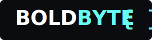

# BOLDBYTE Portfolio Website



A modern, responsive portfolio website for BOLDBYTE web development studio built with React, Tailwind CSS, and shadcn/ui components.

## 🚀 Features

- **Modern UI/UX**: Clean, professional dark-themed design with custom animations
- **Responsive Layout**: Fully responsive design that works on all devices
- **Portfolio Showcase**: Dynamic project gallery with detailed case studies
- **Client Testimonials**: Real feedback from satisfied clients
- **Contact System**: Form submission with email integration
- **Team Profiles**: Professional team member displays

## 💻 Tech Stack

- **Frontend**: React, TypeScript, Tailwind CSS
- **UI Components**: shadcn/ui component library
- **Styling**: Custom Tailwind configuration with animations
- **Form Handling**: React Hook Form with Zod validation
- **Email Integration**: SendGrid for contact form submissions
- **State Management**: React Query
- **Routing**: Wouter for lightweight routing
- **Icons**: Lucide React icons

## 📦 Project Structure

```
client/
├── src/
│   ├── assets/          # Images, SVGs, and static files
│   ├── components/      # Reusable UI components
│   │   ├── ui/          # Base UI components
│   │   └── ...          # Higher-level components
│   ├── hooks/           # Custom React hooks
│   ├── lib/             # Utilities and helpers
│   ├── pages/           # Page components
│   └── App.tsx          # Main application component
server/
├── index.ts             # Express server setup
├── routes.ts            # API route definitions
├── sendgrid.ts          # Email service integration
└── storage.ts           # Data storage utilities
shared/
└── schema.ts            # Shared data schemas
```

## 🔧 Environment Setup

### Prerequisites
- Node.js (v16 or higher)
- npm or yarn

### Environment Variables
Create a `.env` file in the root directory with the following variables:
```
SENDGRID_API_KEY=your_api_key_here
```

## 📋 Getting Started

1. Clone this repository
   ```
   git clone https://github.com/yourusername/boldbyte-portfolio.git
   ```

2. Install dependencies
   ```
   npm install
   ```

3. Start the development server
   ```
   npm run dev
   ```

4. Open your browser and navigate to http://localhost:5000

## 📱 Responsive Design

The site is fully responsive with breakpoints for:
- Mobile devices (< 640px)
- Tablets (640px - 1024px)
- Desktops (> 1024px)

## 🔒 Security

- Form inputs are validated using Zod
- Backend API routes include input validation
- Environment variables are used for sensitive data

## 📄 License

This project is licensed under the MIT License - see the LICENSE file for details.

## 🤝 Contact

For inquiries about this project or to work with us, please visit [boldbytestudio.com](https://boldbytestudio.com) or email us at boldbyte.studio@gmail.com